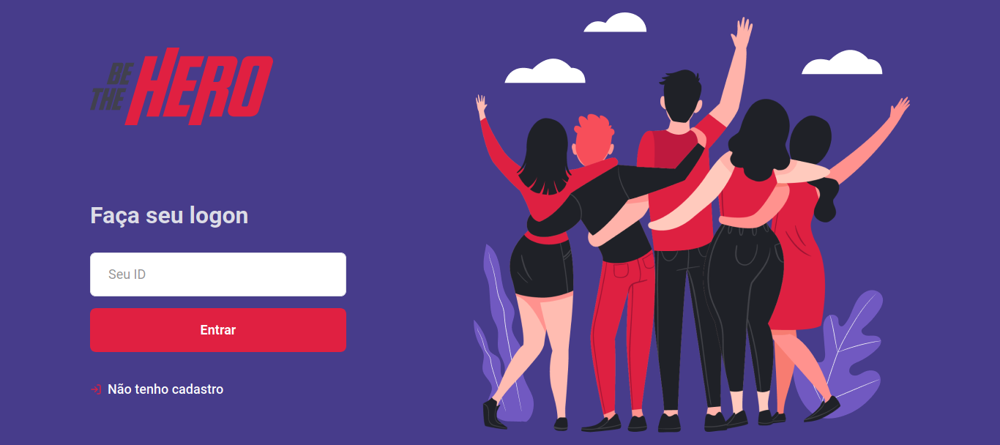
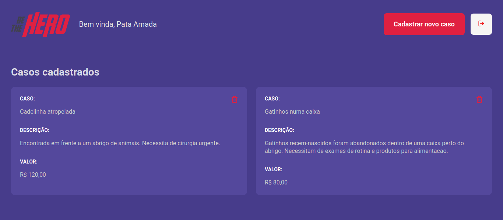

<h1 align="center">
  
  <br/>
  Be the Hero
</h1>

<h4 align="center">
  🚀️<strong>Rocketseat Omnistack 11.0 week application in Blue Theme</strong>
</h4>

<p align="center">
    
  
  
  
</p>

<p align="center">
  <a href="#rocket-technologies">Thecnologies</a>&nbsp;&nbsp;&nbsp;|&nbsp;&nbsp;&nbsp;
  <a href="#warning-prerequisites">Pre-requirements</a>&nbsp;&nbsp;&nbsp;|&nbsp;&nbsp;&nbsp;
  <a href="#information_source-getting-started">Getting Started</a>&nbsp;&nbsp;&nbsp;
</p>

## Show Application
<p align="center">
  
  <br/>
  
</p>

### Description

🖥️ The Web version is for Ongs register their incidents that people can be the hero!  
📲️ And the mobile version is for people who wants to search and choose the case they want to help!

## :rocket: Technologies

#### Backend
-  [Node.js](https://nodejs.org/en/)
-  [Express](https://expressjs.com/pt-br/)
-  [knex](http://knexjs.org/#Installation) - query builder
-  [SQLite3](https://www.sqlite.org/index.html)

#### Frontend
-  [React Js](https://github.com/facebook/react)

#### Mobile
-  [React Native](https://github.com/facebook/react-native)

## :warning: Prerequisites

To run this aplication you need to download:
- [Git](https://git-scm.com)
- [Node.js v12.18.1](https://nodejs.org/dist/v12.18.1/node-v12.18.1-linux-x64.tar.xz) - LTS version
- [npm](https://www.npmjs.com/package/npm) - package manager
- mobile version : download __expo__ app!
  
## :information_source: Getting Started

```bash
# Clone this repository
$ git clone https://github.com/esterandr02/Be-the-hero.git

# Go into the repository
$ cd Be-the-hero
```
### Backend

```bash
$ cd backend

# Install dependences
$ npm i

# Run the backend
$ npm start

obs: Ctrl + C to stop the server(backend) and the frontend too.
```

### Frontend

```bash
$ cd frontend

# Install dependences
$ npm i

# Run the frontend
$ npm start
```

### Mobile
```bash
$ cd mobile

# Install dependences
$ npm i

# Install Expo in the command line
npm install expo-cli --global

# Start Expo
$ expo start 

# Connect your mobile device on USB
# Now you need to have the expo app on your device, then you can load the QR code in your camera.

```

Made with ♥ by Ester :wave: [Get in touch!](https://www.linkedin.com/in/ester-albuquerque-3589911a6/)
